## 我的项目介绍

### 基于多传感器融合的室内移动机器人SLAM系统（2020年6月~2021年4月）

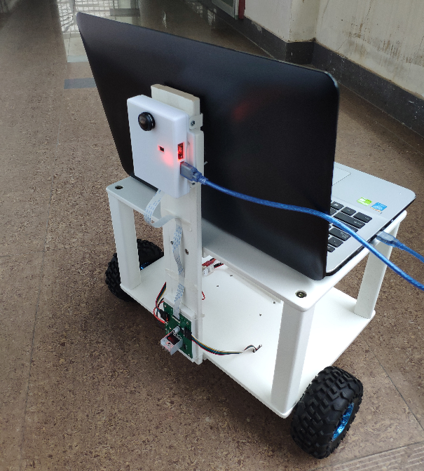

该项目融合单目相机、陀螺仪和轮式里程计数据，实现室内移动机器人的定位和稀疏点云建图。整个项目的硬件、软件都是独自完成的。下面是具体的工作内容：

#### 硬件部分：

硬件部分负责采集传感器数据以及控制机器人电机，具体工作有：

1、设计PCB，实现各个器件之间的连接，下面是两块PCB的实物图，pcb之间通过软排线连接

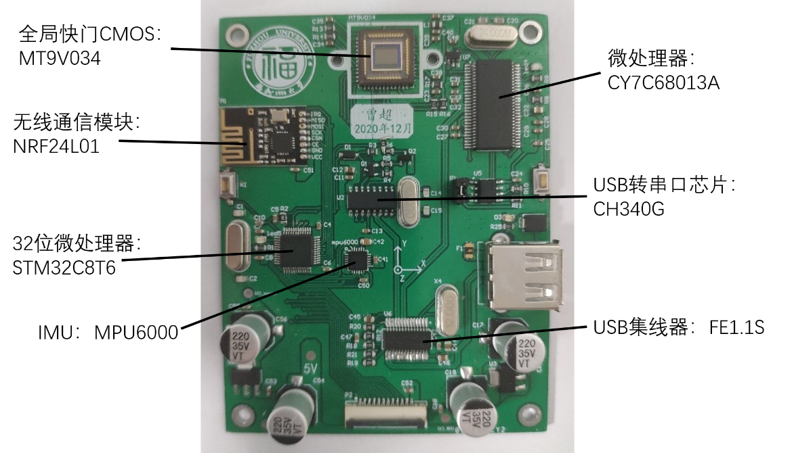  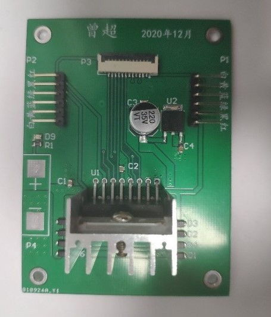  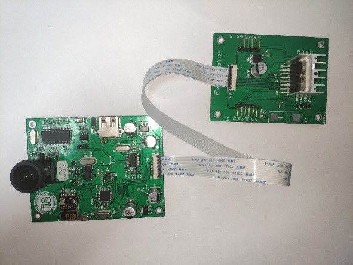

2、根据三种传感器的特性，实现单目相机、IMU、轮式里程计之间的硬件时间同步；根据传感器通信接口，实现传感器原始数据的读取，并通过USB接口发送到PC端

3、PC端通过USB接口接收传感器原始数据，并将数据格式转换后发送到ROS的Topic中，下图显示的是PC端接收到的传感器数据，其中加速度计的单位是m/s2,陀螺仪的单位为rad/s,轮式里程计的单位是rad/s。

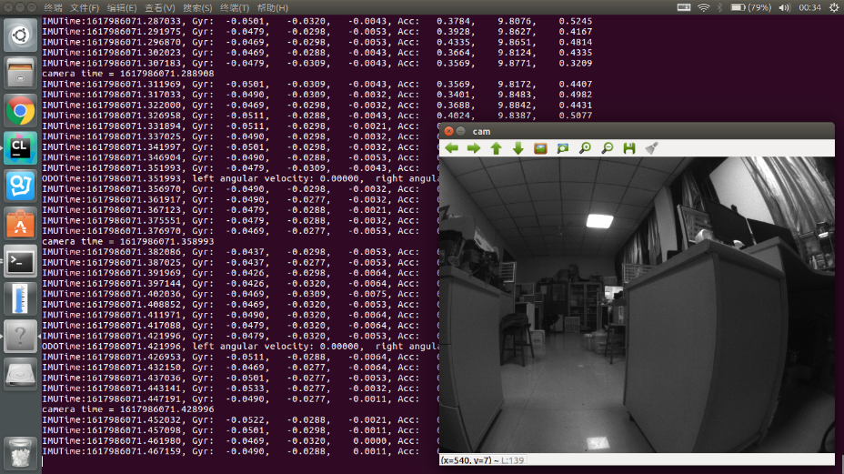

#### 软件部分：

软件部分使用的是VINS-Mono的框架，VINS-Mono在室内移动机器人场景中会发生尺度漂移，我的思路是使用轮式里程计的数据代替VINS-Mono中的加速度数据，整体框架如下图所示，我主要修改了原框架中的预积分、初始化和非线性优化三个模块。

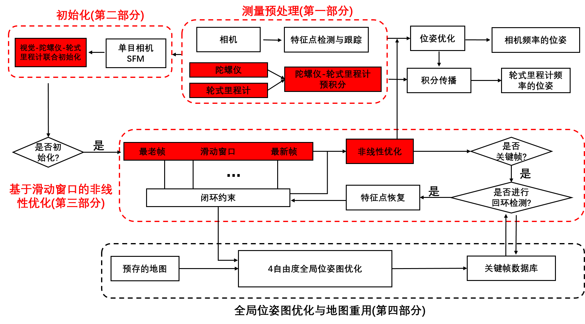

1. 预积分部分：推导了基于陀螺仪、轮式里程计的预积分公式以及预积分误差传递公式，并在工程中实现。
2. 初始化部分：推导了基于单目相机、陀螺仪和轮式里程计的联合校准公式，计算出系统初始运行时的陀螺仪零偏和单目相机尺度，并在工程中实现。
3. 非线性优化部分：推导出各个残差项的公式以及各个残差项对优化变量的雅可比矩阵，并在工程中实现。

#### 移动机器人平台搭建：

1、用SolidWorks设计出电路板外壳，并用3D打印机打印出来，下图显示的分别是3D模型图和实物图

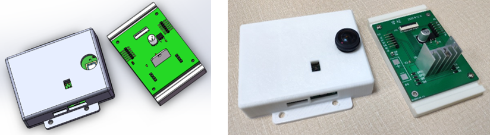

2、用木材制作出移动机器人底盘：

​                                                      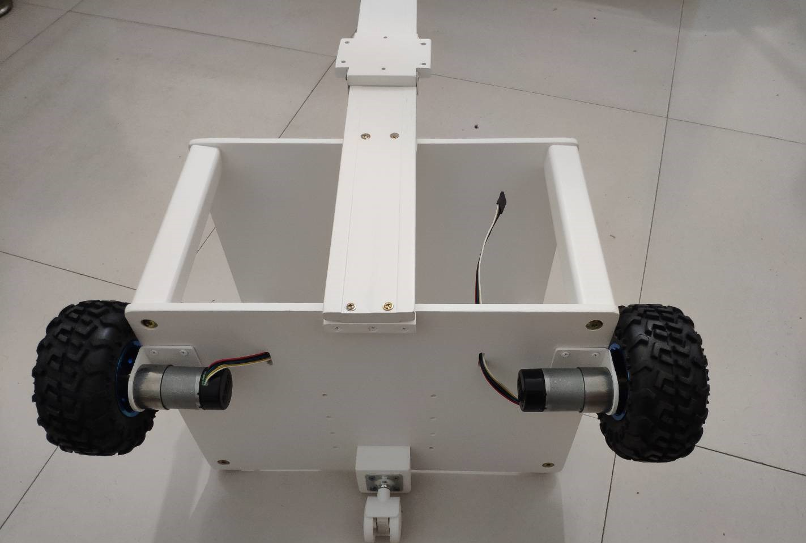                            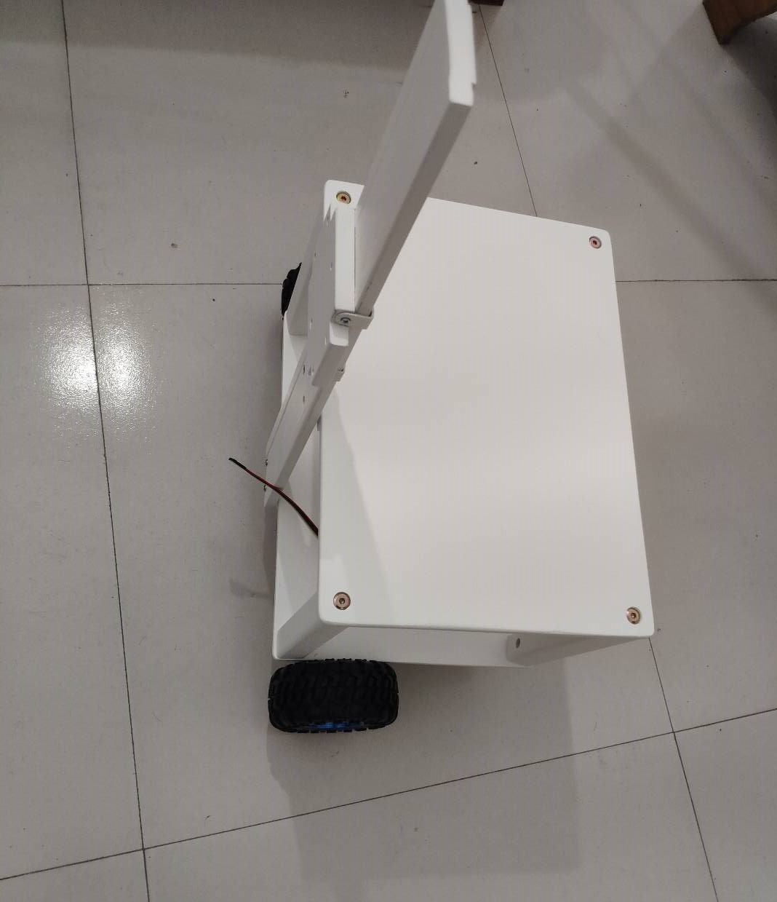   

3、标定单目相机、IMU、轮式里程计内参，单目相机-IMU外参，IMU-轮式里程计外参。

#### 机器人定位和建图效果：

测试的场景是福州大学物信学院5楼的走廊，遥控机器人走一个完整的闭环，同时采集传感器的数据，用采集到的数据分别运行我的系统和VINS-Mono，两个系统都关闭了回环检测，下图显示的是两个系统建立的稀疏地图以及计算的轨迹。

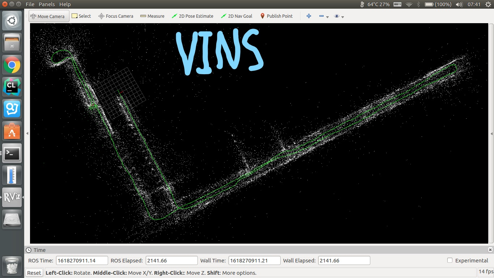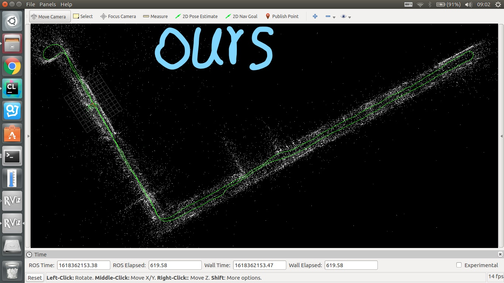 

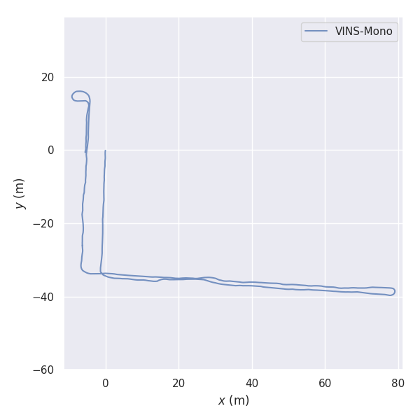

VINS-Mono在移动机器人场景中会发生尺度漂移的情况，改进后的系统很好的解决了该问题。整个轨迹长度273米左右，VINS-Mono最后一帧关键帧的定位误差为5.576米，改进后的系统最后一帧关键帧的定位误差为0.556米。

### 四轴飞行器（2018年7月~2019年6月）

四轴飞行器从硬件到软件都是独自完成，飞行器能够稳定的飞行，并且能够通过气压计定高，主要工作如下：

#### 硬件：

​	设计、制作、焊接飞控板PCB，搭建四轴飞行器，微处理器使用的是STM32F407VET6，IMU使用的是MPU9250，气压计使用的是BMP280，无线通信模块使用的是NRF24L01和一个蓝牙模块

#### 软件：

1、设计四轴飞行器初始化算法，计算初始时刻陀螺仪的零偏和加速度计的尺度

2、通过互补滤算法解算出无人机姿态与飞行高度

3、通过PID算法控制四轴飞行器的姿态和飞行高度。

无人机和飞控板实物图：

​                                                               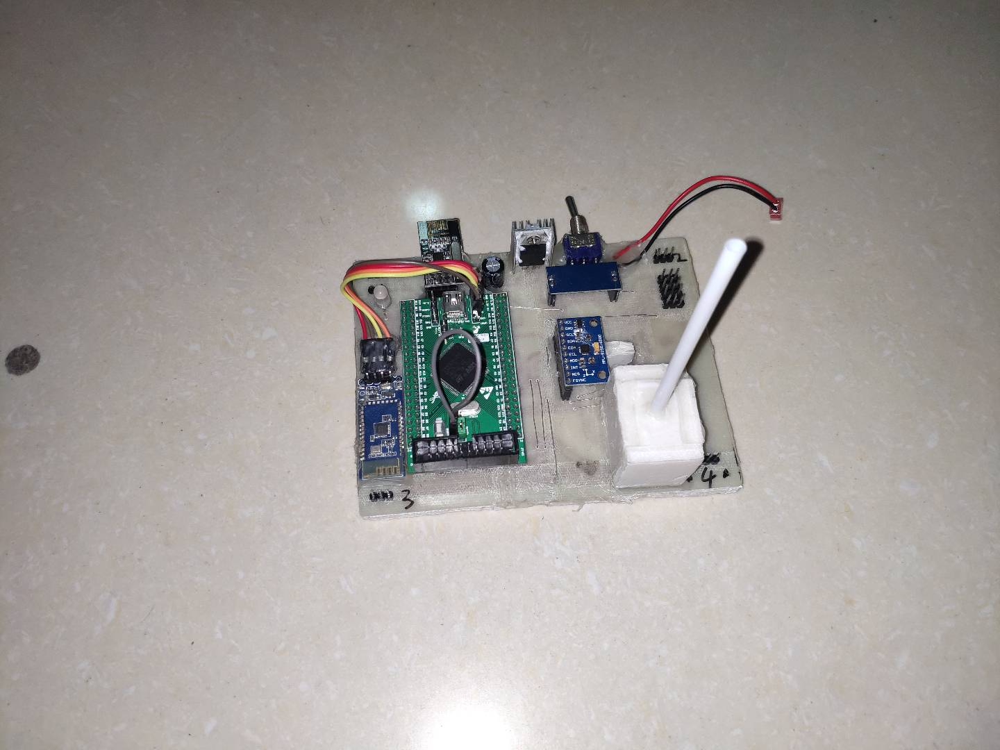

------

